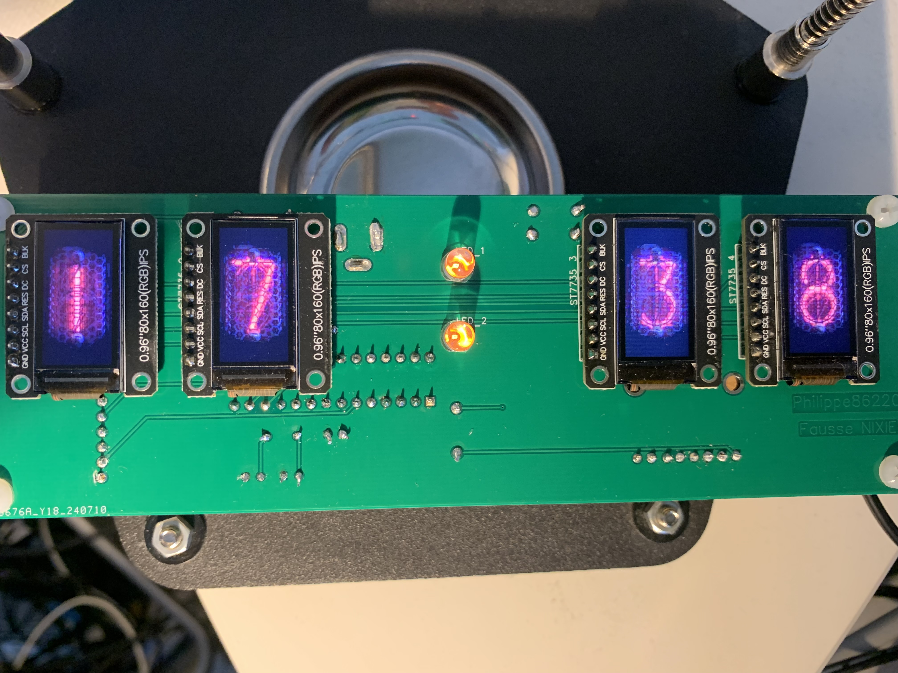
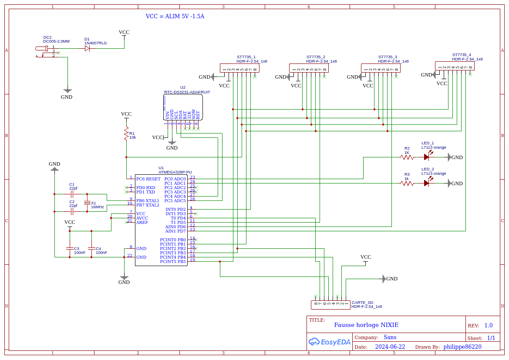
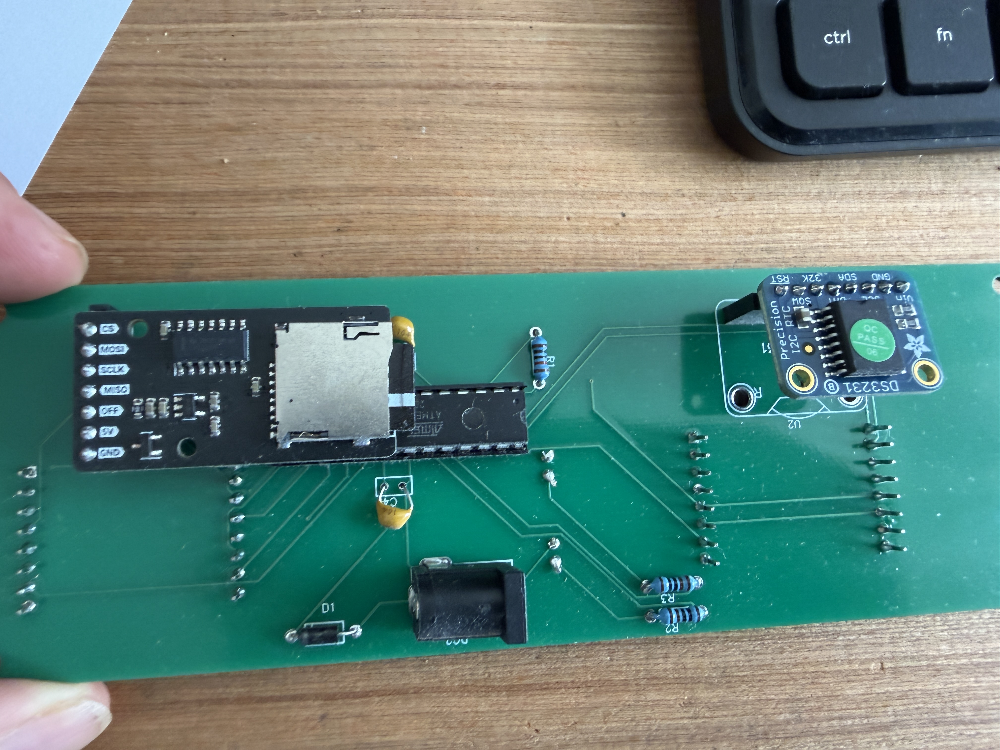
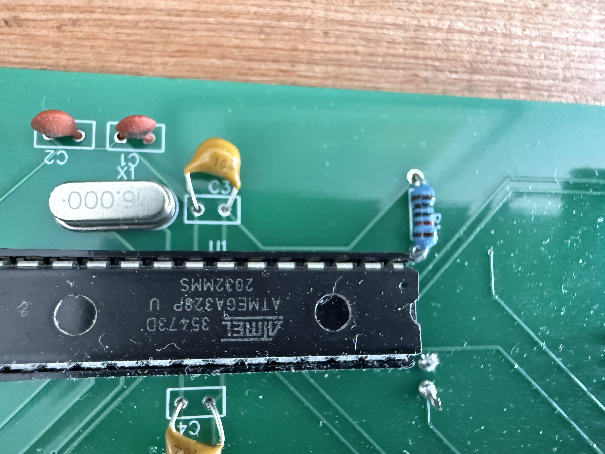
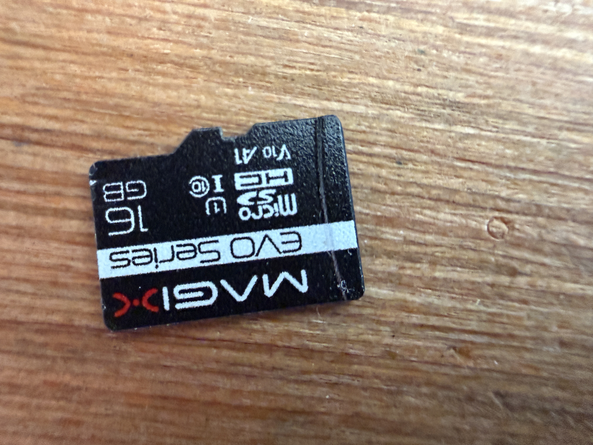
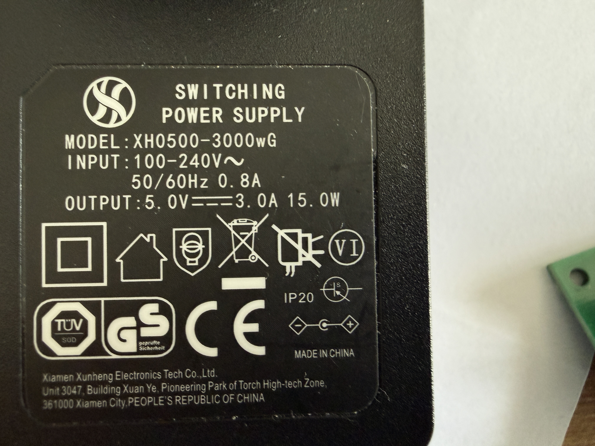

# Horloge à affichage imitation Nixie avec ATmega328P

Cette horloge reproduit l'apparence de tubes Nixie sans employer de véritables tubes haute tension. Quatre petits écrans TFT affichent des images au format BMP représentant les quatre chiffres de l'heure. Deux LED orange placées entre les heures et les minutes clignotent comme les deux points d'une horloge numérique.

Le montage est construit autour d'un **ATmega328P autonome**, installé directement sur un circuit imprimé conçu avec **EasyEDA**. L'heure est conservée par un module RTC DS3231 et les 29 images nécessaires à l'affichage sont lues sur une carte microSD.

> Ce dépôt documente une réalisation personnelle fonctionnelle. Il ne s'agit pas d'une horloge équipée de véritables tubes Nixie : l'effet visuel est produit par des écrans TFT.



## Principe de fonctionnement

Les quatre écrans TFT de 0,96 pouce correspondent chacun à une position de l'heure :

| Écran | Contenu affiché | Fichiers BMP |
|---|---|---|
| TFT 1 | Dizaine des heures | `HD0.bmp` à `HD2.bmp` |
| TFT 2 | Unité des heures | `HU0.bmp` à `HU9.bmp` |
| TFT 3 | Dizaine des minutes | `MD0.bmp` à `MD5.bmp` |
| TFT 4 | Unité des minutes | `MU0.bmp` à `MU9.bmp` |

Les écrans et le lecteur de carte microSD partagent le bus SPI. Chaque écran possède cependant sa propre broche **CS** (*Chip Select*), ce qui permet à l'ATmega328P de sélectionner individuellement l'afficheur à mettre à jour.

Le module RTC DS3231 communique avec le microcontrôleur par le bus I2C. Le programme actualise l'affichage lors d'un changement de minute ou d'heure. Les deux LED orange sont commandées par les sorties `A0` et `A1` et changent d'état toutes les secondes.

## Écrans TFT

L'affichage est constitué de quatre petits écrans TFT couleur de **0,96 pouce** et de **80 × 160 pixels**, pilotés par un contrôleur **ST7735** et utilisant une interface SPI.

Chaque écran n'affiche qu'un seul chiffre :

```text
┌───────┐ ┌───────┐   ●   ┌───────┐ ┌───────┐
│   H   │ │   H   │   ●   │   M   │ │   M   │
│dizaine│ │ unité │       │dizaine│ │ unité │
└───────┘ └───────┘       └───────┘ └───────┘
   TFT 1      TFT 2           TFT 3      TFT 4
```

Les deux LED orange situées entre les deuxième et troisième écrans constituent le séparateur entre les heures et les minutes.

### Communication SPI

Les quatre écrans utilisent le même bus SPI :

- `D11` : MOSI, données envoyées vers les écrans ;
- `D13` : SCK, horloge SPI ;
- `D9` : ligne commune `DC`, permettant de distinguer les commandes des données graphiques.

Chaque écran possède en revanche sa propre ligne **CS** (*Chip Select*) :

| Écran | Fonction | Broche CS |
|---|---|---:|
| TFT 1 | Dizaine des heures | D2 |
| TFT 2 | Unité des heures | D5 |
| TFT 3 | Dizaine des minutes | D6 |
| TFT 4 | Unité des minutes | D7 |

Le microcontrôleur peut ainsi partager les mêmes lignes SPI entre les quatre afficheurs tout en sélectionnant individuellement celui auquel les données sont destinées.

La carte microSD utilise également ce bus SPI et dispose de sa propre ligne de sélection `SD_CS` sur `D4`.

### Pilotage par la bibliothèque Adafruit

Le programme crée une instance `Adafruit_ST7735` pour chacun des quatre écrans :

```cpp
Adafruit_ST7735 tft  = Adafruit_ST7735(TFT_CS,  TFT_DC, TFT_RST);
Adafruit_ST7735 tft2 = Adafruit_ST7735(TFT_CS2, TFT_DC, TFT_RST);
Adafruit_ST7735 tft3 = Adafruit_ST7735(TFT_CS3, TFT_DC, TFT_RST);
Adafruit_ST7735 tft4 = Adafruit_ST7735(TFT_CS4, TFT_DC, TFT_RST);
```

La ligne de réinitialisation n'est pas commandée par l'ATmega328P :

```cpp
#define TFT_RST -1
```

Les écrans sont donc pilotés avec une ligne `DC` commune et quatre lignes `CS` indépendantes.

### Affichage des chiffres

Les chiffres ne sont pas dessinés par le programme à l'aide d'une police de caractères. Ils sont enregistrés sous forme d'images **BMP 24 bits** sur la carte microSD.

Lorsqu'un chiffre doit changer, la fonction :

```cpp
bmpDraw()
```

ouvre le fichier BMP correspondant, lit progressivement ses pixels depuis la carte microSD, les convertit au format couleur attendu par le ST7735 puis les transmet à l'écran sélectionné.

Cette solution permet de reproduire graphiquement l'apparence d'un chiffre de tube Nixie tout en utilisant des écrans TFT basse tension.

Comme chaque écran est associé à une position précise de l'heure, seulement **29 images** sont nécessaires :

- 3 images pour la dizaine des heures ;
- 10 images pour l'unité des heures ;
- 6 images pour la dizaine des minutes ;
- 10 images pour l'unité des minutes.

Soit :

```text
3 + 10 + 6 + 10 = 29 images
```

Les écrans ne sont redessinés que lorsque le chiffre correspondant doit changer. Il n'est donc pas nécessaire de rafraîchir continuellement les quatre afficheurs.

## Matériel

| Quantité | Composant | Remarque |
|---:|---|---|
| 1 | ATmega328P-PU | Microcontrôleur AVR 8 bits monté sur support |
| 1 | Quartz 16 MHz | Horloge de l'ATmega328P |
| 2 | Condensateurs 22 pF | Associés au quartz |
| 2 | Condensateurs 100 nF | Découplage de l'alimentation du microcontrôleur |
| 1 | Résistance 10 kΩ | Rappel au niveau haut de la broche `RESET` |
| 4 | Écrans TFT 0,96 pouce, 80 × 160 pixels | Contrôleur ST7735, interface SPI |
| 1 | [Module RTC I2C DS3231 ADA3013](https://www.gotronic.fr/art-module-rtc-i2c-ds3231-ada3013-24708.htm) | Horloge temps réel de précision avec pile de sauvegarde |
| 1 | [Lecteur de carte microSD uPesy](https://www.gotronic.fr/art-lecteur-carte-microsd-upesy-37485.htm) | Stockage des 29 images BMP |
| 1 | Carte microSD | Une très faible capacité suffit pour les images |
| 2 | [LED orange 5 mm L7113NC](https://www.gotronic.fr/art-led-5-mm-l7113nc-2086.htm) | Séparateur clignotant entre heures et minutes |
| 2 | Résistances 1 kΩ | Limitation du courant dans les LED |
| 1 | Diode 1N4007 | Protection en série sur l'entrée d'alimentation |
| 1 | Connecteur d'alimentation 5,5 × 2,0 mm | Entrée de l'alimentation continue |
| 1 | Alimentation stabilisée 5 V – 1,5 A | Alimentation directe du circuit |
| 1 | Circuit imprimé | Conçu avec EasyEDA |

Le montage a d'abord été envisagé avec un régulateur LM7805. Celui-ci a finalement été supprimé puisque l'horloge est alimentée directement par une alimentation stabilisée de 5 V.

## Affectation des broches

Les numéros ci-dessous utilisent la numérotation Arduino correspondant à l'ATmega328P.

| Fonction | Broche Arduino | Broche physique de l'ATmega328P |
|---|---:|---:|
| Sélection TFT 1 (`TFT_CS`) | D2 | 4 |
| Sélection carte microSD (`SD_CS`) | D4 | 6 |
| Sélection TFT 2 (`TFT_CS2`) | D5 | 11 |
| Sélection TFT 3 (`TFT_CS3`) | D6 | 12 |
| Sélection TFT 4 (`TFT_CS4`) | D7 | 13 |
| Commande données/instructions des TFT (`TFT_DC`) | D9 | 15 |
| MOSI — carte microSD et TFT | D11 | 17 |
| MISO — carte microSD | D12 | 18 |
| Horloge SPI — carte microSD et TFT | D13 | 19 |
| LED 1 | A0 | 23 |
| LED 2 | A1 | 24 |
| SDA — module RTC | A4 | 27 |
| SCL — module RTC | A5 | 28 |

La ligne de réinitialisation des écrans n'est pas commandée par une broche du microcontrôleur : `TFT_RST` est donc défini à `-1` dans le programme.

## Schéma électronique

Le schéma présente l'ATmega328P et ses composants associés, le module RTC, le lecteur microSD, les quatre connecteurs destinés aux écrans ainsi que les deux LED orange.



L'alimentation doit fournir un **5 V continu stabilisé**. Il faut respecter la polarité indiquée sur le schéma et ne pas appliquer directement une tension supérieure à l'entrée 5 V du montage.

## Préparation de la carte microSD

Le dossier [`bmp/`](bmp/) contient les 29 images employées par le programme. Elles doivent être copiées **à la racine de la carte microSD**, sans les placer dans un sous-dossier :

```text
HD0.bmp  HD1.bmp  HD2.bmp
HU0.bmp  HU1.bmp  HU2.bmp  HU3.bmp  HU4.bmp
HU5.bmp  HU6.bmp  HU7.bmp  HU8.bmp  HU9.bmp
MD0.bmp  MD1.bmp  MD2.bmp  MD3.bmp  MD4.bmp  MD5.bmp
MU0.bmp  MU1.bmp  MU2.bmp  MU3.bmp  MU4.bmp
MU5.bmp  MU6.bmp  MU7.bmp  MU8.bmp  MU9.bmp
```

Les fichiers sont des images BMP non compressées en 24 bits, format attendu par la fonction `bmpDraw()`.

## Bibliothèques nécessaires

Le programme emploie les bibliothèques suivantes :

- `Adafruit GFX Library` ;
- `Adafruit ST7735 and ST7789 Library` ;
- `SPI`, `SD` et `Wire`, fournies avec le cœur Arduino AVR ;
- [`simpleRTC`](https://forum.arduino.cc/t/partage-librairie-simplertc-ds1307-ds3231-avec-heures-ete-hiver/376814), créée et partagée par **bricoleau** sur le forum Arduino francophone.

Les deux bibliothèques Adafruit peuvent être installées depuis le gestionnaire de bibliothèques de l'IDE Arduino.

### Bibliothèque `simpleRTC`

La bibliothèque `simpleRTC` est utilisée pour communiquer avec le module RTC DS3231 par le bus I2C.

Elle a été publiée par **bricoleau** sur le forum Arduino et prend en charge les circuits RTC **DS1307** et **DS3231**. Elle fournit notamment les méthodes permettant de lire l'heure, les minutes et les secondes et intègre également la gestion des changements d'heure été/hiver.

Dans ce projet, son utilisation reste très simple :

```cpp
RTC.actualiser();

uint8_t h = RTC.heure();
uint8_t m = RTC.minute();
```

`RTC.actualiser()` lit les informations présentes dans le DS3231 et met à jour les valeurs internes de la bibliothèque. Le programme peut ensuite consulter ces valeurs avec `RTC.heure()`, `RTC.minute()` ou `RTC.seconde()`.

La bibliothèque originale et ses exemples sont disponibles ici :

[Librairie simpleRTC — Forum Arduino](https://forum.arduino.cc/t/partage-librairie-simplertc-ds1307-ds3231-avec-heures-ete-hiver/376814)

## Programme

Le programme utilisé par l'horloge est conservé dans son état fonctionnel d'origine :

```text
src/Horloge_Nixie/Horloge_Nixie.ino
```

Au démarrage, il initialise les quatre écrans, la carte microSD et le module RTC, puis affiche immédiatement l'heure avec `AffichageHeure()`.

Dans `loop()` :

1. le programme calcule l'heure et la minute attendues à partir des dernières valeurs conservées par `simpleRTC` ;
2. `RTC.actualiser()` lit ensuite l'heure courante du DS3231 ;
3. les deux LED changent d'état toutes les secondes sans utiliser `delay()` ;
4. les écrans concernés sont redessinés uniquement lors d'un changement d'heure ou de minute.

La fonction `bmpDraw()` lit progressivement chaque image sur la carte microSD et envoie ses pixels à l'écran concerné. Le tampon de 20 pixels constitue un compromis entre la vitesse de lecture et la faible quantité de mémoire vive disponible sur l'ATmega328P.

### Noms de fichiers stockés en mémoire Flash

L'ATmega328P ne dispose que de **2 048 octets de SRAM**. Pour éviter d'en consommer inutilement avec les noms des 29 fichiers BMP, ceux-ci sont stockés dans la mémoire Flash du microcontrôleur grâce à `PROGMEM` :

```cpp
static const char heures[29][8] PROGMEM = {
  "HD0.bmp",
  "HD1.bmp",
  "HD2.bmp",
  ...
  "MU9.bmp"
};
```

Le tableau contient uniquement les **noms des fichiers**. Les images BMP elles-mêmes restent stockées sur la carte microSD.

Lorsqu'une image doit être affichée, le programme transmet directement le nom du fichier conservé en Flash à `bmpDraw()` :

```cpp
bmpDraw(tft, (__FlashStringHelper*) heures[x], 0, 0);
```

Le cast :

```cpp
(__FlashStringHelper*)
```

indique que la chaîne de caractères se trouve en mémoire Flash et non en SRAM.

Le fonctionnement peut être résumé ainsi :

```text
Mémoire Flash de l'ATmega328P
        │
        │  nom du fichier : "HD1.bmp"
        ▼
      SD.open()
        │
        ▼
    Carte microSD
        │
        │  contenu de l'image BMP
        ▼
      bmpDraw()
        │
        ▼
     Écran TFT
```

Le programme utilise la même logique avec la macro `F()` pour certains messages envoyés sur le port série :

```cpp
Serial.print(F("File size: "));
Serial.println(F("BMP format not recognized."));
```

Ces chaînes constantes restent elles aussi en mémoire Flash au lieu d'occuper la SRAM.

Cette optimisation est particulièrement utile sur l'ATmega328P, dont la mémoire vive est limitée.

### Pourquoi conserver le code en l'état ?

Ce programme est celui qui fonctionne réellement dans l'horloge. Certaines parties pourraient être réorganisées ou factorisées, mais une réécriture ferait perdre le lien direct entre le dépôt et la réalisation présentée. Le code est donc publié comme **code original fonctionnel**, accompagné d'explications plutôt que modifié a posteriori.

## Programmation de l'ATmega328P

L'ATmega328P est installé directement sur le circuit imprimé avec son quartz de 16 MHz et les composants nécessaires à son fonctionnement. La préparation d'un microcontrôleur autonome, l'installation éventuelle du bootloader et la méthode de téléversement ne sont pas développées ici.

Une démonstration complète est disponible dans cette vidéo :

[Programmer un ATmega328P autonome — vidéo YouTube](https://www.youtube.com/watch?v=Miov8Kn8dDk)

## Photographies du montage

| Circuit imprimé et modules | ATmega328P et quartz |
|---|---|
|  |  |

| Carte microSD | Alimentation 5 V – 1,5 A |
|---|---|
|  |  |

## Organisation proposée du dépôt

```text
.
├── README.md
├── src/
│   └── Horloge_Nixie/
│       └── Horloge_Nixie.ino
├── bmp/
│   └── 29 fichiers BMP
├── hardware/
│   ├── Schematic_Fausse-Horloge-NIXIE-5V_2026-08-31.png
│   └── fichiers Gerber
└── photos/
    ├── IMG_4048.JPG
    ├── IMG_4049.JPG
    ├── IMG_4050.JPG
    ├── IMG_4051.JPG
    └── IMG_4052.JPG
```

## Origine et crédits

Cette horloge a été conçue et réalisée par **Philippe Costes (`philippe86220`)**. Le circuit imprimé a été dessiné avec EasyEDA.

La fonction `bmpDraw()` ainsi que les fonctions auxiliaires `read16()` et `read32()` proviennent d'un exemple de la bibliothèque graphique Adafruit et ont été adaptées pour recevoir en paramètre les différentes instances de `Adafruit_ST7735`.

La gestion du module DS3231 repose sur la bibliothèque `simpleRTC` de **bricoleau**, publiée sur le forum Arduino francophone.

Le projet a initialement été présenté dans le sujet suivant :

[Horloge imitation chiffres NIXIE — Forum Arduino](https://forum.arduino.cc/t/horloge-imitation-chiffres-nixie/1281899)
